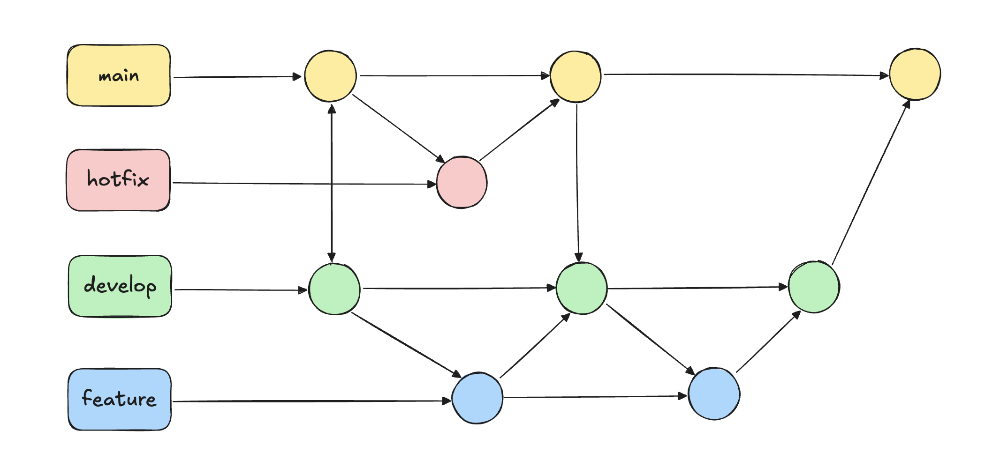

# Playwright Automation Project

## Project Overview

This project is an introduction to automation testing using Playwright. The main objective is to create, execute, and manage test cases efficiently, ultimately building skills that can be used in real-world projects.

