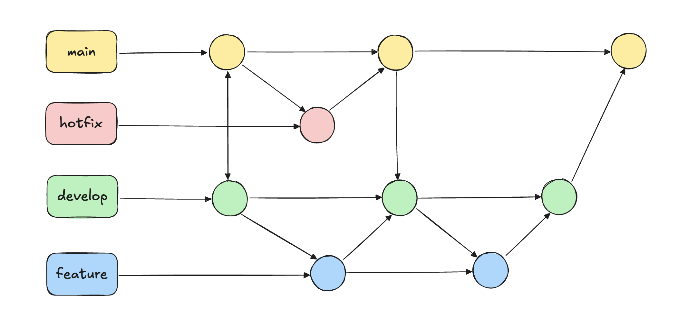
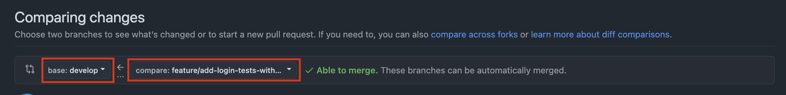
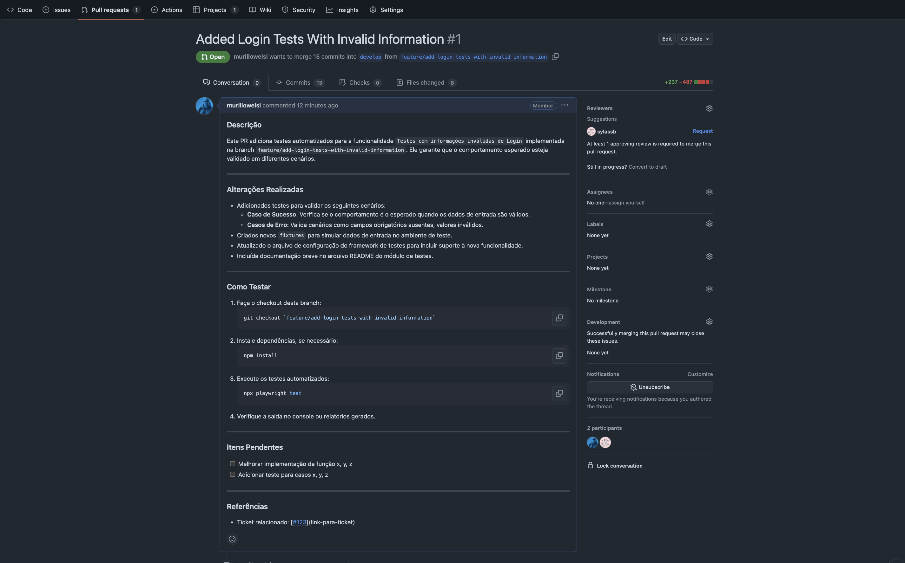

# Task 05

## Git Flow

O **Git Flow** é um modelo de branching que ajuda a organizar o fluxo de trabalho em projetos de desenvolvimento. Ele utiliza duas principais branches permanentes:

### Branch Principal (main)

**Objetivo:** Branch principal, usada para código em produção.

- Não faça commits diretamente. Atualizações ocorrem apenas através de merges vindos de develop ou hotfix.

---

### Branch de Desenvolvimento (develop)

**Objetivo:** Branch de desenvolvimento, usada para consolidar funcionalidades antes de irem para produção.

- Não faça commits diretamente.
- Use esta branch como base para criar novas funcionalidades.

---

### Branch de Novas Funcionalidades (feature/nome-da-sua-funcionalidade)

**Objetivo:** Essas branches são temporárias, e devem ser criadas sempre que desejar implementar uma nova funcionalidade ou fazer alguma mudança no código.

- Não faça commits diretamente.
- Use esta branch como base para criar novas funcionalidades.
- **Importante:** Essa branch deve ser criada sempre a partir da branch `develop`.

---

### Branch de Correção de Emergência (hotfix/nome-da-correção)

**Objetivo:** Usada para corrigir problemas críticos identificados em produção.

- Deve ser criada sempre a partir da branch `main`.
- Após a conclusão da correção, deve ser mergeada de volta para a branch `main` para que o código corrigido seja disponibilizado em produção.
- Em seguida, o merge também deve ser feito da branch `main` para a `develop` para garantir que a correção esteja disponível no fluxo de desenvolvimento contínuo.

---



## Task - Branch Feature

O objetivos dessa task são:

- [ ] Criar uma branch feature.
- [ ] No arquivo `login.spec.ts`, duplique a função do teste - dessa vez com o nome do teste "should access the login page 2".
- [ ] Fazer push da branch criada para o Github.
- [ ] Abrir um pull request da sua branch para a branch `develop`.
- [ ] Aguardar o code review de outro developer.
- [ ] Fazer merge da sua branch para a branch `develop`

As instruções de como realizar esses passos estão abaixo.

---

### Atualize a branch develop

**IMPORTANTE:** Antes de criar a sua branch feature, certifique-se de verificar se sua branch develop está atualizada.

```bash
git checkout develop # Certifique-se que voce está branch develop
git pull develop # Atualize a branch develop
```

---

### Criando a branch feature

Crie a branch feature sempre seguindo o padrão `feature/breve-descricao-do-que-sera-alterado`

```bash
git checkout -b feature/add-login-tests-with-invalid-information # Para criar uma branch a partir da branch develop
git branch --show-current # Para verificar se está na branch criada
```

---

### Trabalhando na nova feature

Após criar a branch feature, você pode começar a implementar as mudanças desejadas.

Conselho: Mantenha os commits granulares (com poucas alterações).
Siga a regra: "Funcionou? Faz commit!" para garantir que cada alteração seja rastreável e fácil de entender.
Você pode fazer vários commits antes de fazer o push do seu código.

```bash
git add .
git commit -m "Adicionado o teste com login válido"
```

```bash
git add .
git commit -m "Adicionado o teste com login inválido e atulizado teste de login válido"
```

---

### Fazendo push da nova branch para o repositório

Quando você teminar todas as alterações necessárias para a sua task, faça o push da nova branch com o código

```bash
git push --set-upstream origin feature/add-login-tests-with-invalid-information
```

O retorno desse comando deve conter o link para que seja aberto o Pull Request no Github

```bash
Enumerating objects: 6, done.
Counting objects: 100% (6/6), done.
Delta compression using up to 8 threads
Compressing objects: 100% (4/4), done.
Writing objects: 100% (4/4), 1.57 KiB | 1.57 MiB/s, done.
Total 4 (delta 2), reused 0 (delta 0), pack-reused 0
remote: Resolving deltas: 100% (2/2), completed with 2 local objects.
remote:
remote: Create a pull request for 'feature/add-login-tests-with-invalid-information' on GitHub by visiting:
remote: https://github.com/QA-Tipocos/qa-automation-project/pull/new/feature/add-login-tests-with-invalid-information
remote:
```

---

### Criando um Pull Request

Após completar o último passo, você terá uma nova branch no Github.
O que queremos agora é criar um `Pull Request` para que outro developer faça um `code review` das suas alterações antes que o código seja merged para a branch develop.

O Pull Request deve ser criado diretamente na página do Github -> [https://github.com/QA-Tipocos/qa-automation-project/pull/new/feature/add-login-tests-with-invalid-information](https://github.com/QA-Tipocos/qa-automation-project/pull/new/feature/add-login-tests-with-invalid-information).

---

#### Escolha a branch com a qual você que fazer merge

- A branch da esquerda: branch com a qual você quer fazer merge -> `develop`
- A branch da direita: branch deve ser a sua branch -> `feature/add-login-tests-with-invalid-information`



---

#### Descrição do PR

A descrição de um Pull Request (PR) de testes deve ser clara, descrever os objetivos, cobrir as alterações feitas e especificar o que foi testado. Exemplo:

````markdown
    ### **Descrição**

    Este PR adiciona testes automatizados para a funcionalidade `Testes com informações inválidas de Login` implementada na branch `feature/add-login-tests-with-invalid-information`. Ele garante que o comportamento esperado esteja validado em diferentes cenários.

    ---

    ### **Alterações Realizadas**

    - Adicionados testes para validar os seguintes cenários:
      - **Caso de Sucesso**: Verifica se o comportamento é o esperado quando os dados de entrada são válidos.
      - **Casos de Erro**: Valida cenários como campos obrigatórios ausentes, valores inválidos.
    - Criados novos `fixtures` para simular dados de entrada no ambiente de teste.
    - Atualizado o arquivo de configuração do framework de testes para incluir suporte à nova funcionalidade.
    - Incluída documentação breve no arquivo README do módulo de testes.

    ---

    ### **Como Testar**

    1. Faça o checkout desta branch:
      ```bash
      git checkout `feature/add-login-tests-with-invalid-information`
      ```

    2. Instale dependências, se necessário:
      ```bash
      npm install
      ```
    3. Execute os testes automatizados:
      ```bash
      npx playwright test
      ```
    4. Verifique a saída no console ou relatórios gerados.

    ---

    ### **Itens Pendentes**

    - [ ] Melhorar implementação da função x, y, z
    - [ ] Adicionar teste para casos x, y, z

    ---

    ### **Referências**

    - Ticket relacionado: [[#123](https://ticket.com/c/link-para-ticket)](link-para-ticket)
````

---

#### Crie o PR e Aguarde o Code Review

Após adicionar o título e uma descrição top para o seu PR, clique no botão `Create Pull Request` e aguarde o Code Review dos seus pares.
Uma vez que o ok for dado pelos seus pares, o PR será aprovado e você poderá fazer o merge da sua branch para a brach develop.


